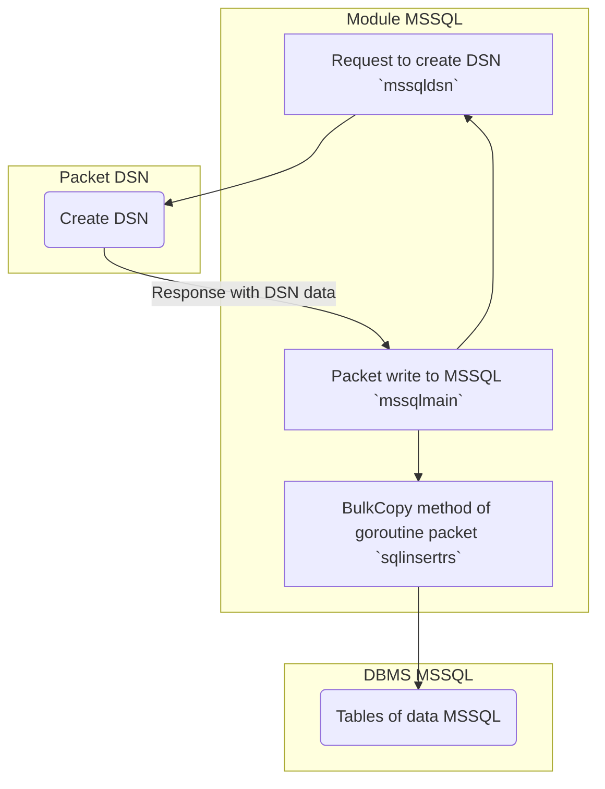
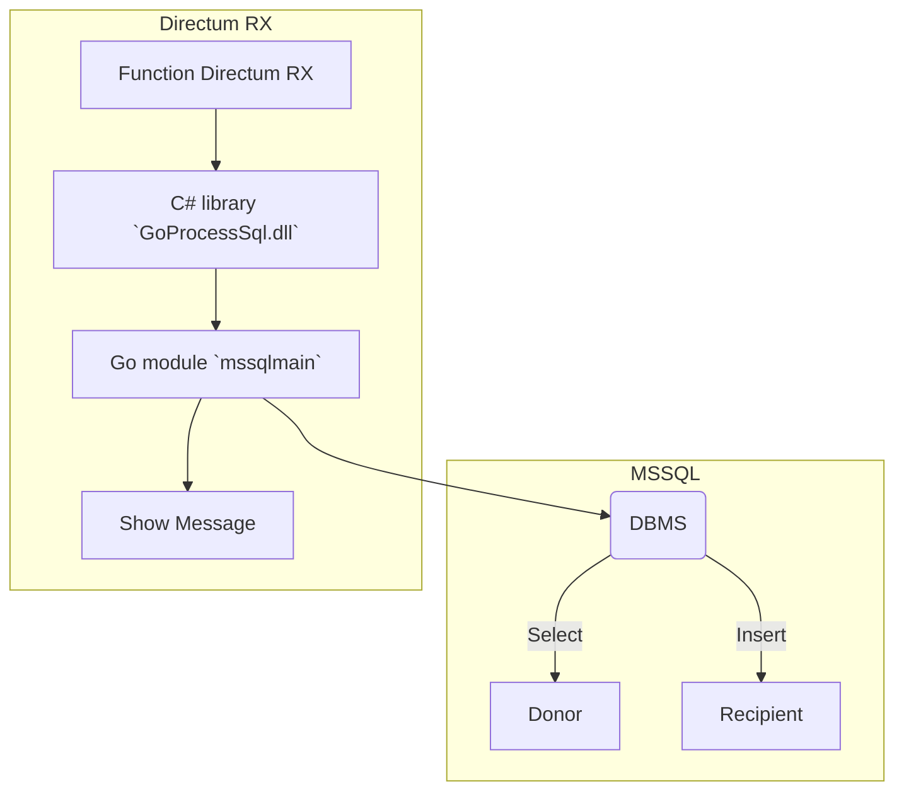

### sqlbulk2dirx
### Ru

Демо пакеты модуля на Go, для копирования данных (sql bulk copy) между таблицами СУБД MSSQL.  
Дополнительный код на C# для подключения Go-модуля как сторонней библиотеки в Directum RX. 

Для выполнения, запустить модуль:  
 
	mssqlmain  

Если параметры подключения DSN верны, проверить появление данных в реципиент-таблице.

***Схема обмена данными между Go-пакетами (scheme exchange of data between Go-packets):***
			


Демо код DS, для вызова сторонней либры из Directum RX. Demo code to call outside library from Directum RX:    

```C#
public vittual void ProcessSqlStart()
{
  var role = Roles.GetAll(r => Equals(r.Name, "Администраторы справочников")).FirstOrDefault();
  if (Users.Current.IncludedIn(role))
  {
    GoProcessSql.MyProcess.Main(); 
    Dialogs.ShowMessage("Копирование справочника SAP выполнено");
  }
  else
  {
    Dialogs.ShowMessage("У пользователя нет прав на копирование справочника");
  }
}
```
В СУБД Directum RX должна быть таблица-справочник: "Администраторы справочников".


### En

It's demo packages on Go for copying data (sql bulk copy) between DBMS tables of MSSQL.   
Additional C# code for connecting the Go-module as outside library in Directum RX.   

For execute, run module:  

	mssqlmain

If DSN connection parameters are correct, check if copyed the data in to recipient-table.    
The Directum RX DBMS should have a reference table: "Directory administrators".

***Общая схема обмена (general exchange scheme):***



